## SCM Pipeline Documentation Outline

### [1. OCI Pipeline Creation](#1-oci-pipeline-creation)
- [1.1 Project Folder Setup](#11-project-folder-setup)  

- [1.2 Setup Tasks for Data Loading](#12-setup-tasks-for-data-loading)  

    • [Data Loader](#data-loader)  
    • [Dataflow](#dataflow)  

- [1.3 Publish Data Loader/Flow to Application](#13-publish-data-loaderflow-to-application)  

- [1.4 Setup Pipeline](#14-setup-pipeline)  
  • [Group Related Data Based on Schema](#group-related-data-based-on-schema)  
  
- [1.5 Scheduling Setup for Pipelines](#15-scheduling-setup-for-pipelines)  
  • [Create and Assign Schedule](#create-and-assign-schedule)  

  • [Verify Scheduled Run and Object Storage Output](#verify-scheduled-run-and-object-storage-output)  
  
- [1.6 Background Python Code](#16-background-python-code)  

### [2. AWS Pipeline Creation](#2-aws-pipeline-creation)
- [2.1 Initial Data Object Check in S3 Buckets](#21-initial-data-object-check-in-s3-buckets)  
- [2.2 Setup Configuration using Glue Script](#22-setup-configuration-using-glue-script)  
- [2.3 Setup “Run Job” Script](#23-setup-run-job-script)  
- [2.4 Create a Crawler](#24-create-a-crawler)  
  • [Define Data Source and Parameters](#define-data-source-and-parameters)  
  • [Assign IAM Role and Database](#assign-iam-role-and-database)  
  • [Run and Schedule Workflow](#run-and-schedule-workflow)  

### [3. Common Issues and Resolutions](#3-common-issues-and-resolutions)
- [3.1 Data Not Updated on SCM Dashboard](#31-data-not-updated-on-scm-dashboard)  
- [3.2 Troubleshooting OCI and AWS Failures](#32-troubleshooting-oci-and-aws-failures)  
- [3.3 File Size Limitations and Extraction Strategy](#33-file-size-limitations-and-extraction-strategy)

---

# **SCM Pipeline:**

# 1. OCI Pipeline Creation

## 1.1 Project Folder Setup

### Data Integration -> Projects: Create/Set up Project Folder 

## 1.2 Setup Tasks for Data Loading

- ### Data Loader or Dataflow

  *Note: Moving forward, it is advised to use Dataflow for flexibility*

### Data Integration -> Projects -> Task 

#### Two type of Task setup, Data Loader and Dataflow

### ### Data Loader

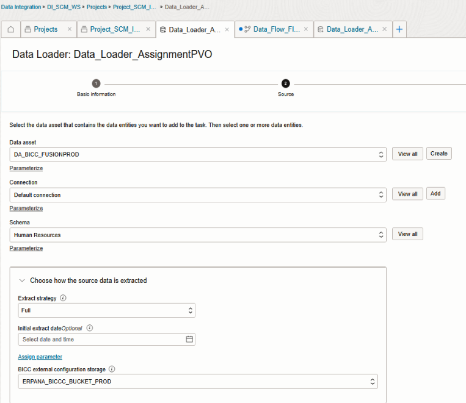  
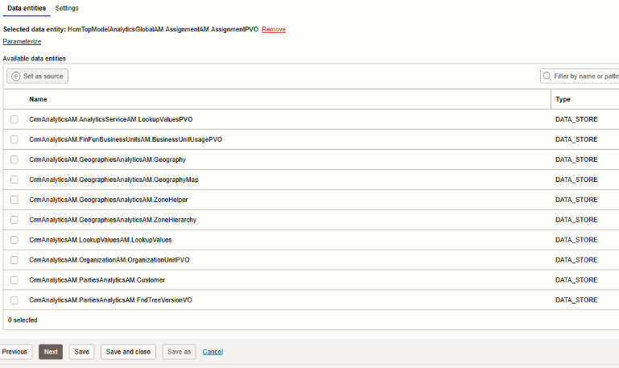

### ### Dataflow

#### Source:

#### Target:

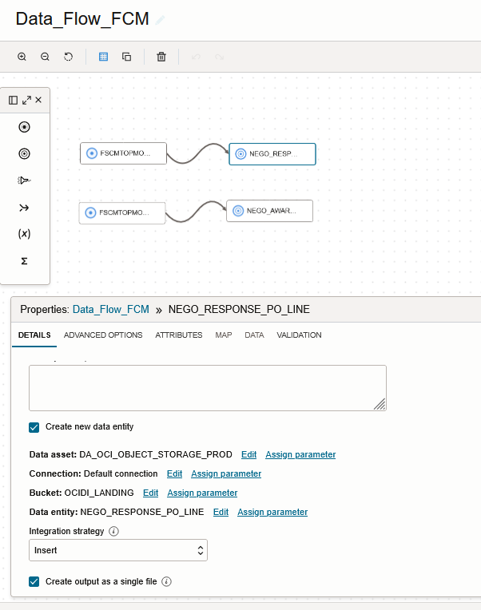

## 1.3 Publish Data Loader/Flow to Application

## 1.4 Setup Pipeline

### Home -> Projects -> Project Name -> Pipelines

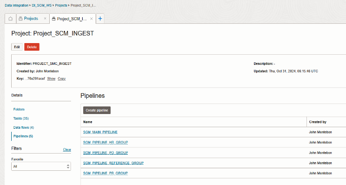

#### Group Related Data Based on Schema

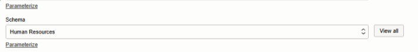  
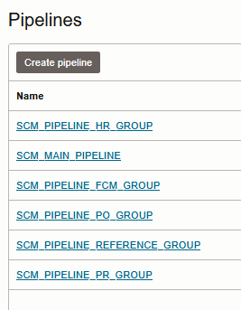  

## 1.5 Scheduling Setup for Pipelines

### Home -> Application -> Default Application

### Create and Assign Schedule

  
  
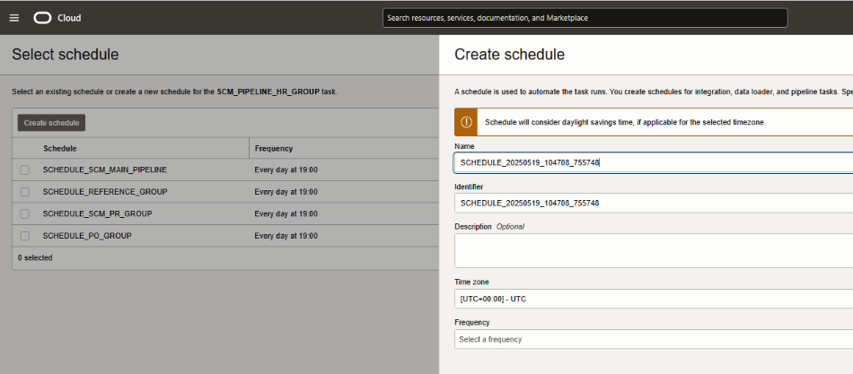  
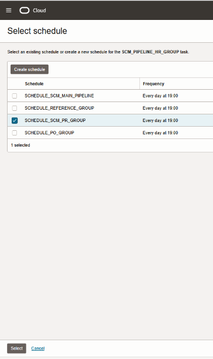

### Verify Scheduled Run and Object Storage Output

  
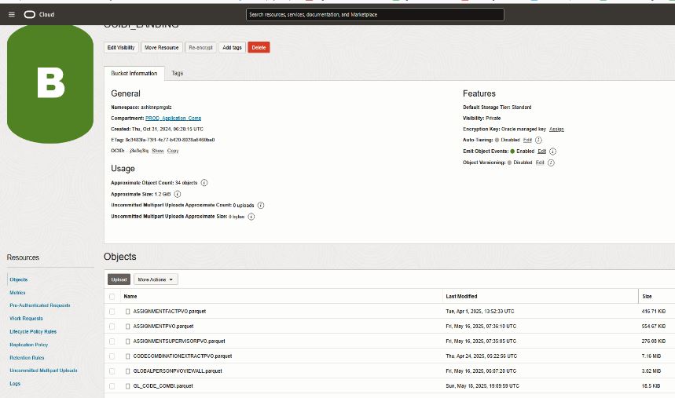

## 1.6 Background Python Code

If changes made in the pipeline is made (new or updated object) it will trigger to copy those objects and put it in...

# 2. AWS Pipeline Creation

## 2.1 Initial Data Object Check in S3 Buckets

- Once data object has been successfully imported to AWS Glue staging bucket `s3://apc-fusion/oci_fusion_data/`  
- It will automatically move to Landing bucket `s3://apc-datalake/landing/fusion/`  
- It is implemented this way for external visibility purposes  
- You can now check the data in the landing bucket  

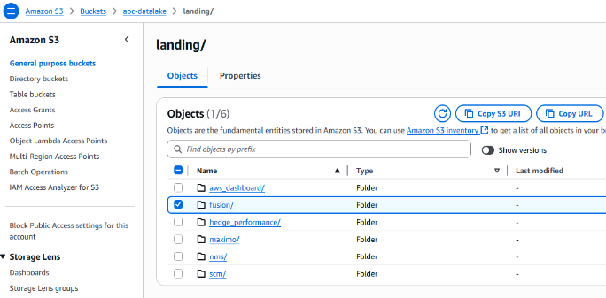

## 2.2 Setup Configuration using Glue Script

This setup ensures that you have a config in the parameter store for connection options, folders, and project setup.

*NOTE:*  
- `ignored_files` = list of objects in the Landing folder that would be excluded in the config  
- `files_to_process` = list of files to process (empty string means all objects will be processed)  

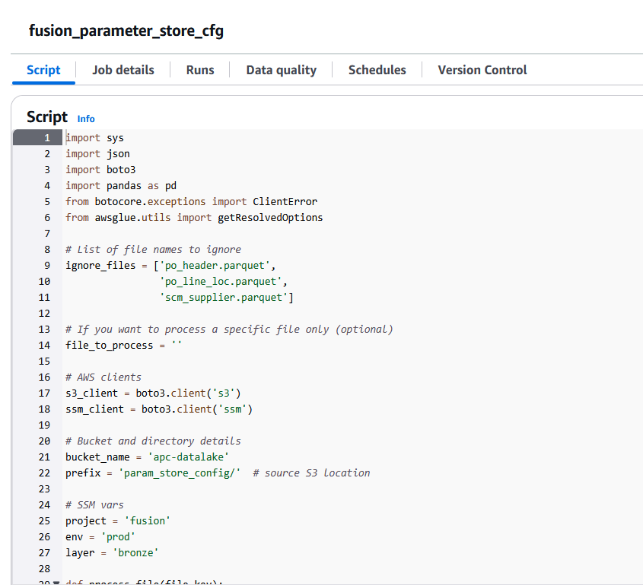

## 2.3 Setup “Run Job” Script

NOTE:  
- To add or omit a data source, edit the list with appropriate DATASET, WRITE_MODE, and FILE_TYPE  
- Dataset name should match the one in parameter store  

WRITE_MODE = `refresh` or `increment`  
FILE_TYPE = `parquet` or `csv`  

Initially run the job manually and check if it is successful.

## 2.4 Create a Crawler

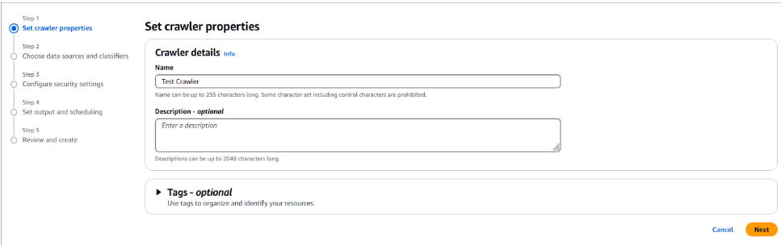

### Define Data Source and Parameters

- Follow provided parameters and save  
- Delta table paths should point to correct s3 path in the bronze layer  

### Assign IAM Role and Database

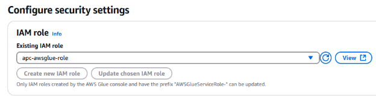  
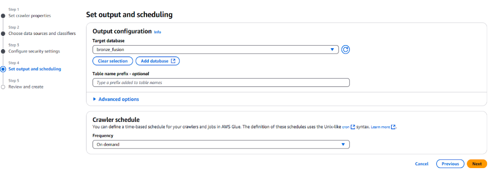

You can create a database by selecting this option:

### Run and Schedule Workflow

- Initially run the Crawler and check if no errors  
- Create Workflow and schedule the job  

## After workflow is created, run it first and check if no issues

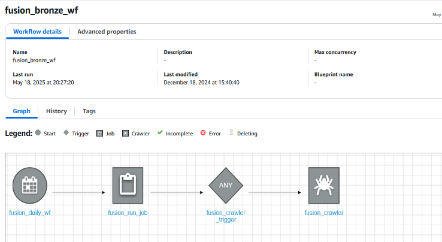

# 3. Common Issues and Resolutions

## 3.1 Data Not Updated on SCM Dashboard

- **Possible Causes:**
  - OCI Scheduling issue → update or recreate the schedule
  - No data present → run OCI job manually and check object file storage
  - AWS Glue job failure → check Job Monitoring in Glue
  - File exceeds 25MB → update Extraction Strategy in Data Loader or Dataflow

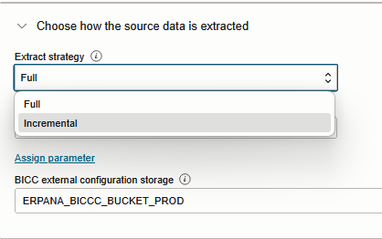