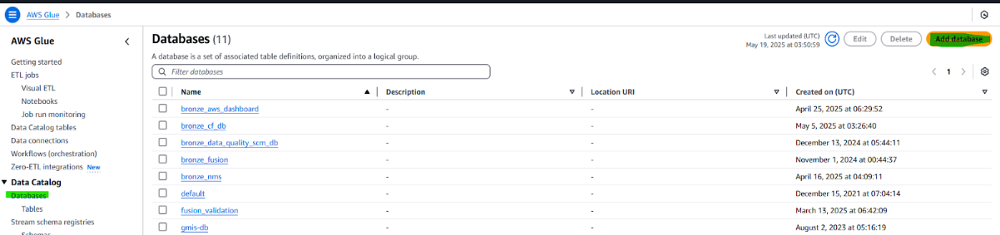

# **SCM Pipeline:**

# 

# OCI Pipeline Creation

## <u>***Project Folder Setup***</u>

### Data Integration -\> Projects: Create/Set up Project Folder 

# 

## ***<u>Setup Tasks for Data loading</u>*** 

- ### Data Loader or Dataflow

  *Note: Moving forward, it is advised to use Dataflow for flexibility*

### Data Integration -\> Projects -\> Task 

# 

#### *Two type of Task setup, Data Loader and Dataflow*

### Data Loader 

# 

# 

### Dataflow

#### *Source:* 

# 

#### *Target:*

### 

## <u>***Once set upped Data Loader/Flow Publish to Application***</u>

#### 

## <u>***Setup Pipeline***</u>

### Home -\> Projects -\> Project Name -\> Pipelines 

# 

#### *Organize Group Related Data* 

#### *Note: Group them based on the “Schema” from the Data Loading Set Up(Data Loader/Flow)* 

##### 				

##### 		

# 

## <u>***Scheduling Set up For Pipelines***</u>

### Home -\> Application -\> Default Application

### Find the pipeline that you created and select schedule on the option

### In schedule portion click select 

# 

### Click create schedule, once done setting up schedule save it 

# 

### Select the created schedule for the pipeline and click the select button below  

# 

### Once done setting up, the pipeline will run the next day based on the time of the schedule that you chose . You can check the loaded object to the bucket (Based on target bucket from Data Loading setup)

# 

# 

## ***<u>Background Python Code</u>***

If changes made in the pipeline is made (new or updated object) it will trigger to copy those objects and put it in

# AWS Pipeline Creation

## <u>***Checking***</u>

- #### Once data object has been successfully imported to AWS Glue staging bucket s3://apc-fusion/oci_fusion_data/ 

- #### It will automatically move to Landing bucket s3://apc-datalake/landing/fusion/ 

- #### It is implemented this way for external visibility purposes

- #### You can now check the data in the landing bucket 

# 

## <u>***Setup configuration using glue script***</u>

### This setup insures that you have a config in the parameter store for connection options, folders and project setup

*NOTE:*

- *ignored_files = list of objects in the Landing folder that would be excluded in the config*

- *files_to_process = list of file you need to process, empty string means all objects in the Landing folder will be process*

# 

## <u>***Setup “Run Job” Script***</u>

NOTE:

- To add or ommit a data source edit the list below with appropriate DATASET, WRITE_MODE and FILE_TYPE

- Dataset name should be same in the dataset name in the parameter store  
  
  # 

&nbsp;

- WRITE_MODE = refresh or increment

- FILE_TYPE = parquet or csv (source object file type)

  # 

  Initially run the job manually and check if it is successful

&nbsp;

## <u>***Create a crawler***</u>

# 

&nbsp;

- #### Add a data source

  # 

&nbsp;

- #### Follow provided parameters and save

- #### Delta table paths should point to correct s3 path in the bronze layer  
  
  # 
  
- #### Select the IAM role  
  
  # 
  
- #### Select the database

  # 

  NOTE: You can create a database by selecting this option  

  # 

- #### Initially run the Crawler and check if no errors

- #### Create Workflow and schedule the job  
  
  # 

&nbsp;

## <u>***After workflow is created, run it first and check if no issues***</u>  

# 

# Common Issue(s) and Resolution(s)

- Data not updated on SCM Dashboard

  - Possible Cause

    - OCI Scheduling issue

      - Need to update or recreate the schedule

    - Possible no data at all

      - Try to run the OCI job manually and see if Object File storage in OCI is updated

    - AWS Glue job failure

      - You can check on the Job Monitoring in Glue and pinpoint the actual error if exist

    - File exceeds 25mb in OCI Object Storage

      - Since we have a limitation of file size when transferring from OCI Object Storage to AWS S3 if the file exceeds 25mb you need to change the Extraction Strategy in either Data Loader or Dataflow

        # 
